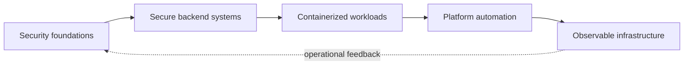
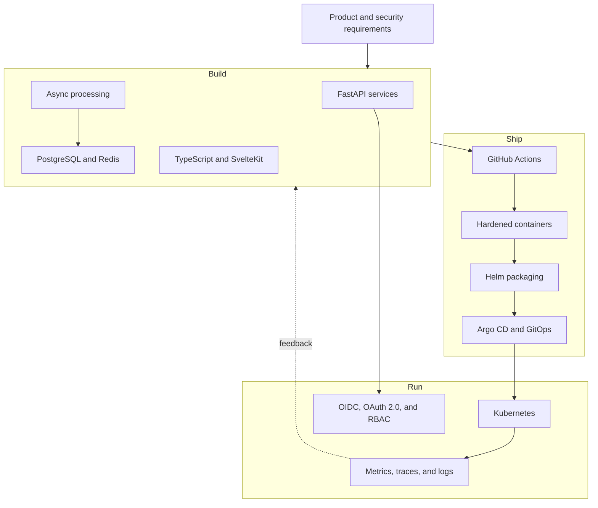
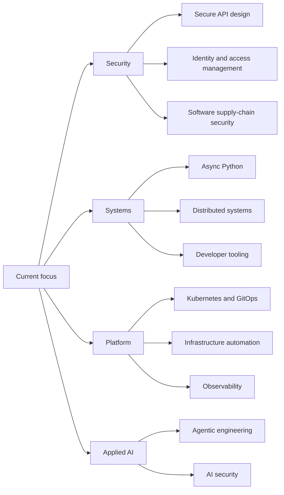

 
 

 

## `about`

Software Engineer with a cybersecurity and computer science background, focused on secure backend systems, platform engineering, and developer automation.

Current work spans Python and FastAPI services, asynchronous processing, PostgreSQL, Redis, Docker, Kubernetes, GitHub Actions, GitOps, identity systems, and observability.

Technical interests center on secure API design, distributed systems, application security, infrastructure automation, software supply-chain security, and AI-assisted engineering workflows that preserve review, verification, and actual comprehension.

## `whoami`

## `core stack`

 

## `engineering toolkit`

### Backend and Data

 

### Platform and Delivery

 

### Security and Identity

 

### Observability and Operations

 

### Python Tooling

 

### Frontend and Interfaces

 

## `current interests`

## `engineering signals`

 

## `activity`

 

 

 

